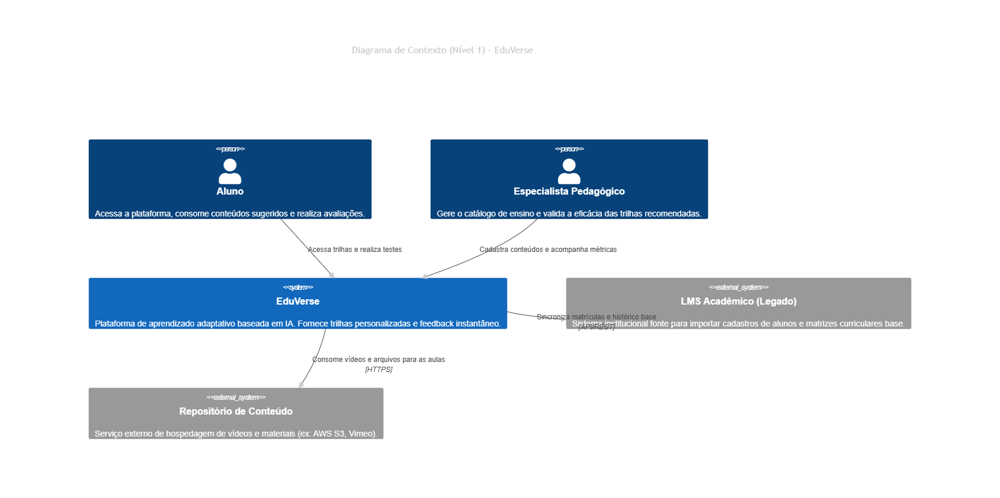
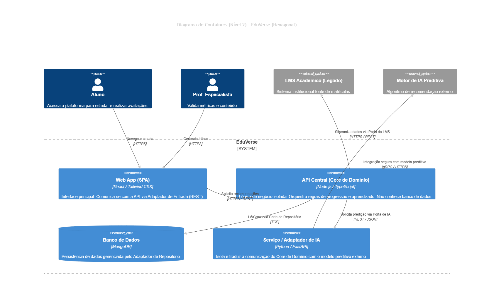

# Template do Aluno: Mini Projeto "O Arquiteto Decisor"

**Aluno:** Lucas Santos da Conceição | 

---

## 🟢 CICLO 1: Visão e Requisitos (Fase 1)

### 1.1 Resumo do Cenário de Negócio
O EduVerse é uma plataforma de aprendizado online inovadora que visa resolver o problema da educação padronizada e engessada. O contexto de negócio foca em adaptar o ensino ao ritmo e estilo de cada aluno, utilizando um Sistema de Recomendação baseado em Inteligência Artificial para identificar lacunas de conhecimento e gerar trilhas de estudo dinâmicas. Os usuários principais são os Alunos (consumidores do conteúdo adaptativo) e os Professores/Especialistas Pedagógicos (responsáveis por validar a eficácia pedagógica e alimentar o repositório de conteúdos). O sistema exige alta disponibilidade e processamento rápido para não interromper o fluxo de estudo.

### 1.2 Atributos de Qualidade (RNFs) Priorizados
* **Desempenho / Performance:** A API de Inteligência Artificial deve responder às requisições em menos de 200ms. *Justificativa:* No contexto de negócio, demoras na recomendação geram atrito na experiência de estudo, podendo causar desengajamento do aluno. O impacto técnico exige consultas otimizadas e baixa latência de rede.
* **Escalabilidade:** O sistema deve suportar milhares de alunos conectados e consumindo vídeos/avaliações simultaneamente. *Justificativa:* Plataformas educacionais sofrem picos de acesso em horários específicos. A arquitetura deve escalar horizontalmente para absorver essa carga sem degradação.
* **Usabilidade:** A interface deve ser responsiva, intuitiva e fluida em diferentes dispositivos (Mobile e Web). *Justificativa:* O público-alvo é diversificado. Uma usabilidade complexa ofuscaria a inteligência do motor de recomendação. A entrega do conteúdo sugerido deve parecer natural ao usuário.
* **Confiabilidade / Reliability:** O sistema deve possuir estratégias de *fallback* e *Cold Start* eficientes. *Justificativa:* Se o serviço de IA ficar indisponível ou o aluno for novo (sem dados históricos), a plataforma não pode parar. O impacto técnico exige que o sistema principal seja resiliente a falhas de microsserviços secundários.
* **Manutenibilidade:** O código e a infraestrutura devem facilitar atualizações modulares. *Justificativa:* O catálogo de cursos e os modelos de IA evoluirão constantemente. Uma arquitetura desacoplada permite que os engenheiros implantem novos algoritmos ou integrem novos repositórios de conteúdo (LMS) sem derrubar a plataforma inteira.

### 1.3 Diagrama de Contexto (C4 Nível 1)

### 1.4 Classificação da Estratégia
* **Classificação:** Balanceada
* **Justificativa:** A estratégia adota inovações tecnológicas (uso de IA e bancos NoSQL para velocidade) para agregar valor ao negócio, mas isola o risco através de uma arquitetura resiliente (mecanismos de *fallback* e contingência). Conforme Pressman discute sobre a natureza do software, ele se deteriora por mudanças constantes. Uma abordagem balanceada permite o encapsulamento dessas mudanças, garantindo que a evolução natural do modelo de IA não quebre a estabilidade da plataforma principal ao longo do tempo.

---

## 📚 Anexos e Entregas Extras

* **[Anexo 1: ADR 001 - Escolha do Banco de Dados Principal](adrs/adr_001.md)**

## 🔵 CICLO 2: Blueprint e Decisões (Fase 2)

### 2.1 Diagrama de Containers (C4 Nível 2)

### 2.2 Parecer Técnico: Custo vs. Desempenho
A escolha pela Arquitetura Hexagonal impacta minimamente o desempenho em milissegundos devido às camadas de abstração, mas reduz drasticamente o custo financeiro de longo prazo. O isolamento do domínio garante que a substituição de componentes caros de infraestrutura não exija a reescrita de regras de negócio, protegendo o investimento no desenvolvimento do "cérebro" do sistema.

### 2.3 Registro de Decisões Técnicas
* [ADR 001 - Escolha do Banco de Dados NoSQL](adrs/adr_001.md)
* [ADR 002 - Adoção da Arquitetura Hexagonal](adrs/adr_002.md)